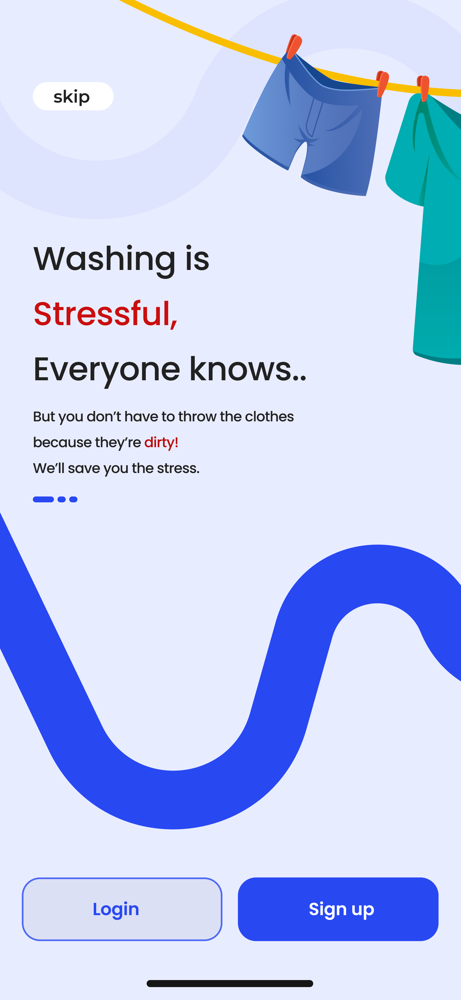

# Emmanuel Kema Portfolio

This is the portfolio website of Emmanuel Kema, showcasing his skills and work in software development.

## Table of Contents
- [About Me](#about-me)
- [Services](#services)
- [Portfolio](#portfolio)
- [Contact](#contact)

## About Me
Emmanuel Kema is a talented and knowledgeable developer with a solid grasp of both web and mobile development. He specializes in crafting quality solutions that deliver better results. With a number of soft skills, Emmanuel is an invaluable member of any team.

### Skills
- UI/UX: Designing Web/App interfaces
- Web Development: Web app Development
- App Development: Building Android/Ios Apps

### Experience
- **2021 - Current:** UI/UX Design at Aptech Institute
- **2019 - 2021:** Team lead at Zimesfield
- **2017 - 2019:** Internship at hireus.ng LTD
- **2023 - Current:** C.E.O Creative Devs

### Education
- **2017:** UI/UX Design Training at Aptech Institute
- **2019:** Website Development Training at Aptech
- **2021:** Mobile Development Training at Aptech

## Services
### Web Design
Crafting visually appealing and user-friendly websites tailored to your needs. We specialize in creating modern, responsive designs that enhance your online presence and drive engagement.

### UI/UX Design
Elevating user experiences through intuitive interface design and seamless interactions. Our approach focuses on understanding user needs and behaviors to create engaging and delightful experiences.

### App Design
Bringing your app ideas to life with captivating and user-centric designs. We specialize in designing mobile applications that not only look great but also provide exceptional usability and functionality.

## Portfolio
### Todo List App

The Todo List App is a mobile application designed to help users organize their tasks efficiently. With a sleek and intuitive interface, users can easily add, delete, update, and mark tasks as completed, all at their fingertips.

### Logistics App

An app that specializes in seamless Logistics solutions for your needs.

### Laundry App

The app connects you to talented people around the world. Download it from the play store.

## Contact
- **Email:** emmakema47@gmail.com
- **Phone:** +234 904 305 4638
- **Social:**
  - [Facebook](https://web.facebook.com/emmanuel.kemakolam.7)
  - [Twitter](https://twitter.com/Emmakema47)
  - [Instagram](https://www.instagram.com/iamemma47/)
  - [LinkedIn](https://www.linkedin.com/in/kemakolam-emmanuel-17378918a/)
- [Download CV](images/Resume.pdf)
